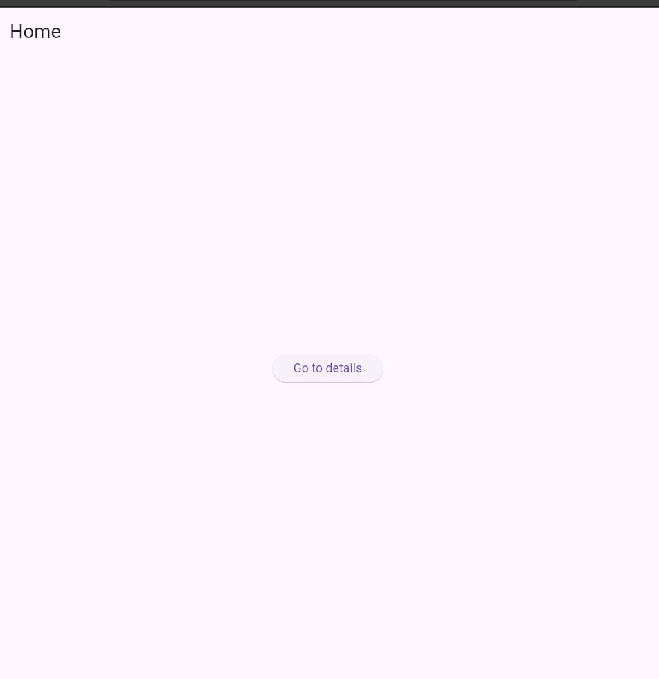
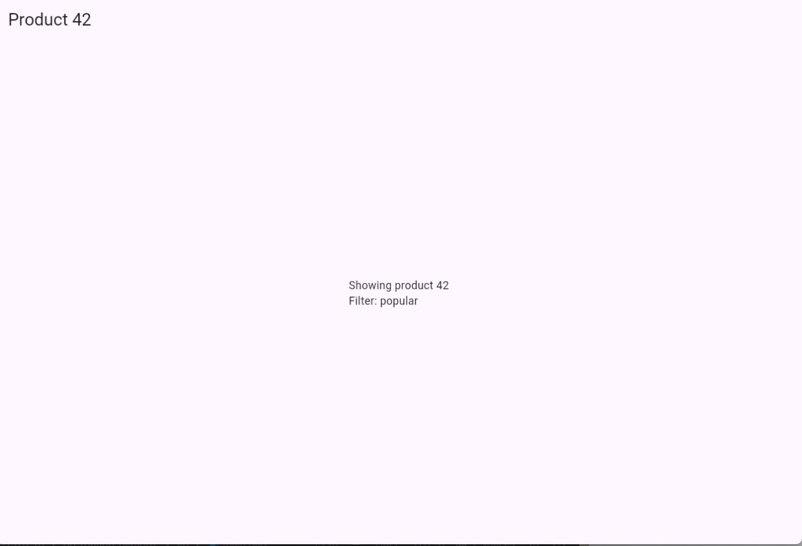
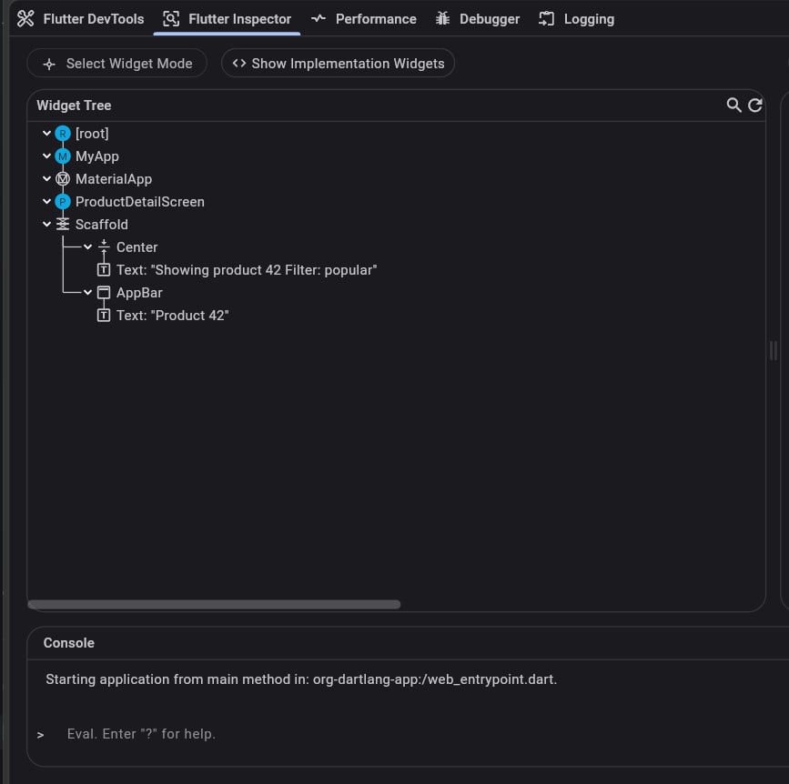

# go_routing_demo02
This project uses go_router to navigate between homepage and detailspage and adds parameters in the router.
---here is the screenshot of the running page

---here is the screenshot of the widget tree
