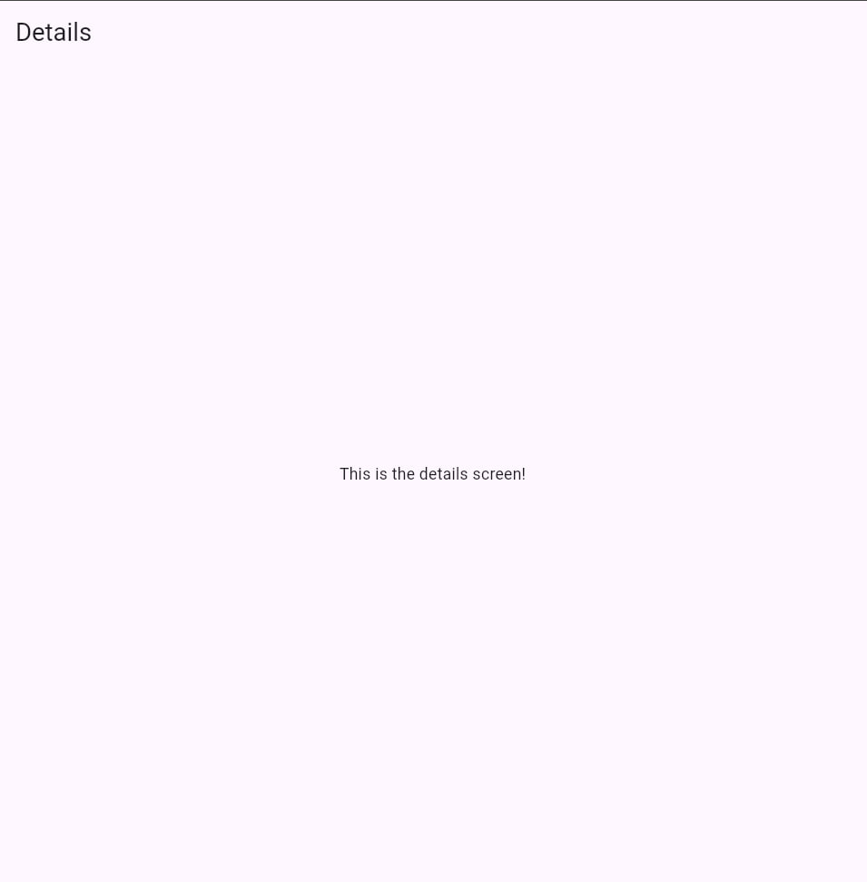
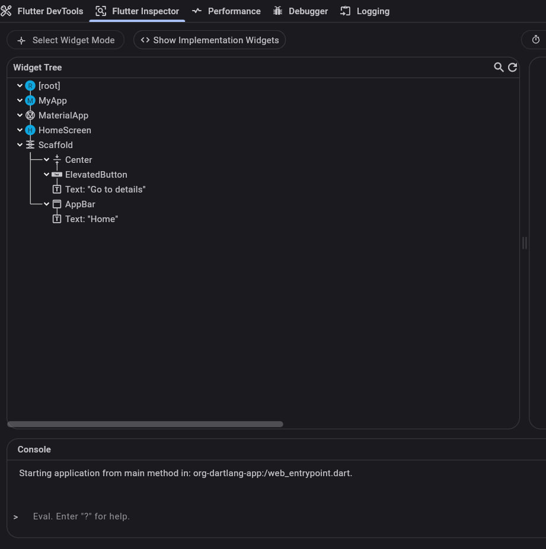
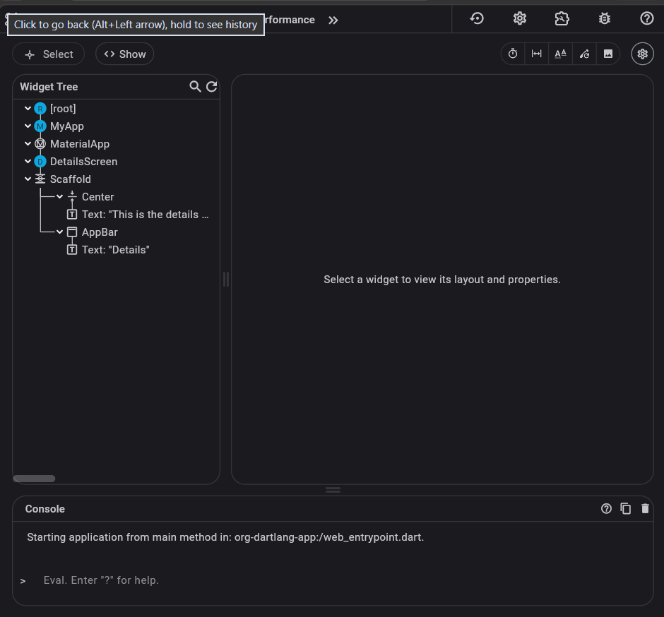

# go_routing_demo1

This project uses go_router to navigate between homepage and detailspage it uses named routers.
---here is the screenshot of the running page

---here is the screenshot of the widget tree

